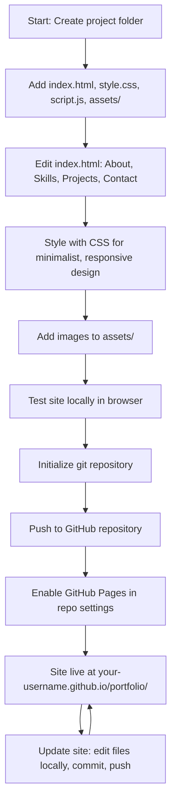

# Minimalist Portfolio Website

A clean, single-page portfolio website with a white/black minimalist theme. Sections: About, Skills, Projects, Contact. Designed for easy deployment on GitHub Pages.

---

## Table of Contents

- [Features](#features)
- [Project Structure](#project-structure)
- [Setup Instructions](#setup-instructions)
- [HTML/CSS/JS Structure](#htmlcssjs-structure)
- [Responsive Design & Accessibility](#responsive-design--accessibility)
- [Deployment to GitHub Pages](#deployment-to-github-pages)
- [Best Practices](#best-practices)
- [Mermaid Diagrams](#mermaid-diagrams)

---

## Features

- Minimalist, modern design (white/black)
- Responsive layout for all devices
- Semantic, accessible HTML
- Easy to maintain and extend
- Ready for GitHub Pages deployment

---

## Project Structure

```
portfolio/
├── index.html
├── style.css
├── script.js
├── assets/
│   ├── profile.jpg
│   ├── project1.png
│   └── project2.png
└── README.md
```

---

## Setup Instructions

1. **Create the Project Folder**

   ```sh
   mkdir portfolio
   cd portfolio
   ```

2. **Create Files and Folders**

   - `index.html` — main HTML file
   - `style.css` — styles
   - `script.js` — (optional) interactivity
   - `assets/` — images (profile, projects)
   - `README.md` — this documentation

3. **Add Content**

   - Fill in each section in `index.html` (About, Skills, Projects, Contact)
   - Add images to `assets/` (use placeholders if needed)

4. **Test Locally**

   - Open `index.html` in your browser to preview

---

## HTML/CSS/JS Structure

- **index.html**
  - Uses semantic tags: `<header>`, `<main>`, `<section>`, `<footer>`
  - Four main sections: About, Skills, Projects, Contact
  - Links to `style.css` and (optionally) `script.js`

- **style.css**
  - CSS variables for colors and spacing
  - Flexbox/Grid for layout
  - Media queries for responsiveness
  - High contrast, large touch targets

- **script.js**
  - (Optional) For smooth scrolling, form validation, or other interactivity

---

## Responsive Design & Accessibility

### Responsive Design Strategies

- Use relative units (`em`, `rem`, `%`, `vw`, `vh`) for sizing text, spacing, and layout.
- Apply a **mobile-first** approach: start with styles for small screens, then use media queries for larger breakpoints.
- Use **CSS Flexbox** and **Grid** for flexible, adaptive layouts.
- Stack sections vertically on mobile; use columns or cards on desktop.
- Set breakpoints at common device widths (e.g., 600px, 900px, 1200px) to adjust layout and font sizes.
- Make images and media responsive with `max-width: 100%` and `height: auto`.
- Avoid fixed widths; use `min-width` and `max-width` for containers.
- Test on multiple devices and browsers to ensure consistent appearance.

### Accessibility Best Practices

- Use semantic HTML elements (`<header>`, `<nav>`, `<main>`, `<section>`, `<footer>`, etc.) for structure.
- All images must have descriptive `alt` text.
- Ensure sufficient color contrast (WCAG AA or better) for text and UI elements.
- Provide large, easily tappable touch targets for buttons and links.
- Ensure all interactive elements are accessible via keyboard (tab order, focus states).
- Use ARIA attributes only when necessary to enhance screen reader support.
- Label form fields and buttons clearly.
- Avoid using color alone to convey information.
- Test with screen readers (e.g., NVDA, VoiceOver) and keyboard navigation.
- Minimize motion and flashing to avoid triggering vestibular disorders.

By following these strategies, your portfolio will be usable and visually appealing on all devices, and accessible to all users.

---

## Deployment to GitHub Pages

### Prerequisites

- A GitHub account ([sign up here](https://github.com/join) if you don't have one)
- [Git](https://git-scm.com/) installed on your computer

### 1. Create a New GitHub Repository

- Go to [GitHub](https://github.com/) and create a new repository (e.g., `portfolio`)
- Set the repository to **public**
- Do **not** initialize with a README, .gitignore, or license (you already have these locally)

### 2. Initialize Local Repository and Push Code

In your project folder, run:

```sh
git init
git add .
git commit -m "Initial commit"
git branch -M main
git remote add origin https://github.com/your-username/portfolio.git
git push -u origin main
```

Replace `your-username` with your actual GitHub username.

### 3. Enable GitHub Pages

- Go to your repository on GitHub
- Click **Settings** > **Pages** in the sidebar
- Under **Source**, select the `main` branch and `/ (root)` folder
- Click **Save**
- After a few moments, your site will be live at:
  `https://your-username.github.io/portfolio/`

### 4. Update Your Site

Whenever you make changes:

```sh
git add .
git commit -m "Describe your changes"
git push
```

GitHub Pages will automatically update your site within a minute or two.

### 5. (Optional) Set a Custom Domain

- In **Settings > Pages**, add your custom domain (e.g., `www.yourdomain.com`)
- Update your DNS records to point to GitHub Pages (see [GitHub Docs](https://docs.github.com/en/pages/configuring-a-custom-domain-for-your-github-pages-site/about-custom-domains-and-github-pages))
- GitHub will automatically create a `CNAME` file in your repo

### Troubleshooting

- If your site doesn't appear, check the **Pages** section for errors or warnings.
- Make sure your `index.html` is in the root of the repository.
- Clear your browser cache or try incognito mode if updates don't show.
- For more help, see [GitHub Pages Documentation](https://docs.github.com/en/pages).


---

## Best Practices

- Use semantic HTML tags
- Organize CSS by section, use variables
- Comment code for clarity
- Test on multiple devices and browsers
- Use descriptive alt text for all images
- Ensure keyboard and screen reader accessibility

---

## Mermaid Diagrams

**Project Structure**
```mermaid
graph TD
    A[portfolio/ (project root)]
    A --> B[index.html]
    A --> C[style.css]
    A --> D[script.js]
    A --> E[assets/]
    A --> F[README.md]
    E --> E1[profile.jpg]
    E --> E2[project1.png]
    E --> E3[project2.png]
    B --> B1[header]
    B --> B2[main]
    B2 --> B3[About section]
    B2 --> B4[Skills section]
    B2 --> B5[Projects section]
    B2 --> B6[Contact section]
    B --> B7[footer]
    B --> C
    B --> D

%% Legend
    classDef file fill:#fff,stroke:#111,stroke-width:1px;
    class B,C,D,F,E,E1,E2,E3 file;
```

**Workflow**


---

**You are now ready to build and deploy your minimalist portfolio!**